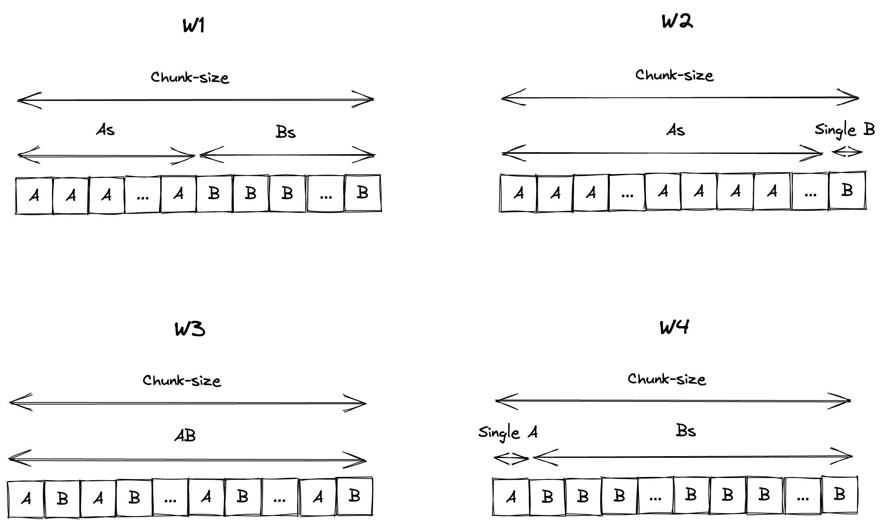

# kEPLr

kEPLr is an in-memory complex event processing and stream processing system built on top of Kafka Streams. 

## Experiments

There are 4 experiments for testing kEPLr, each one based on a complex event processing pattern. Here we report the pattern using an [EPL-like syntax](http://esper.espertech.com/release-8.1.0/reference-esper/html/event_patterns.html).

- **W1** is `every A -> every B where timer:within(n)`, it returns all events of type A followed by all events of type B within a given time `n`
- **W2** is `every A -> B where timer:within(n)`, it returns all events of type A followed by the first event of type B within a given time `n`
- **W3** is `every (A -> B where timer:within(n))`, it returns all subsequent succession of an event of type A followed by an event of type B within a given time `n`
- **W4** is `A -> (every B)`, it returns the first event of type A followed by all event of type B, here no `within` is used, since there is always one active pattern that searches for a B event

For each experiment, we have 4 data generation methods, based on the concept of _data chunk_. A chunk is a cohesive group of events A and B, built as the following

### Executing the experiments

1. Go in the folder `./scripts/experiments/`
2. kafka Startup: run script `./kafka-start.sh`
3. Produce the datasets,i.e., run `./load.sh` parameters can be set through the script, `chunk-size`, which defines the `within` parameter within the query, and `chunk-number`, how many chunk to produce
4. for other options run `./load.sh --help`
5. run the experiments, i.e., run `./start-fixed`, `chunk-size` and `chunk-numbers` lists within the script **must be the same as the `load.sh` script**, for other option run `./start-fixed --help`

Experiments run on both Kafka Streams and Esper. 
